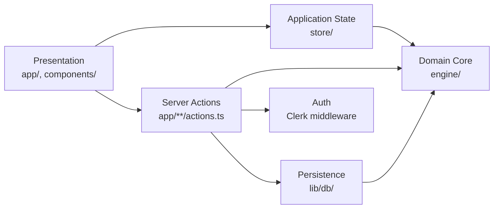

# Architecture Spine — strukt

## Design Paradigm

**Layered architecture with an isolated pure-computation domain core.** Four layers, strict one-way dependency:



- **Domain core (`engine/`)** — pure functions and types. The Direct Stiffness Method solver, the data model, the Cross-Section catalog. Zero dependency on React, Next.js, zustand, or the database — this is what makes it independently testable against the benchmark suite (AD-9) and safe to run identically client-side or in a Server Action.
- **Application state (`store/`)** — zustand. Owns the *active, in-session* canvas structure (Nodes, Elements, Supports, Loads, Materials, Cross-Sections — always SI, AD-4) and solve results (`results`/`showSteps`, AD-2/AD-3). The unit-system display preference is a UI flag, not store-owned canonical data (AD-4). Never owns the Projects list or the auth session (AD-6).
- **Server Actions (`app/**/actions.ts`)** — the only layer allowed to touch `lib/db/` or Clerk's session. Project CRUD and any future server-only logic lives here, not scattered across components.
- **Persistence (`lib/db/`)** — Drizzle schema + Neon client. Nothing above `engine/` depends on it directly except Server Actions.
- **Auth** — Clerk middleware gates routes; session read via Clerk's `auth()` inside Server Actions and server components only.

No layer above Domain may be depended on *by* it. This is the one rule every other AD below assumes.

## Invariants & Rules

### AD-1 — Domain core stays framework-free

- **Binds:** `engine/*`
- **Prevents:** Solver logic entangling with React re-renders, Next.js request lifecycle, or store shape — becoming untestable in isolation and coupled to UI churn.
- **Rule:** `engine/` imports only `mathjs` and its own types/constants. No `react`, `next`, `zustand`, or `lib/db` import ever appears under `engine/`.

### AD-2 — Naming reconciliation `[ADOPTED]`

- **Binds:** `engine/types.ts`, `engine/constants.ts`, `store/useStructureStore.ts`, and every consumer of `Support`/`StructureType`/`Material`
- **Prevents:** The three-way naming drift the PRD and UX spine both flagged (`PINNED` vs `HINGE`, duplicate `StructureType` declarations, `Material` vs `MaterialType`) from silently diverging further as more code is written against it.
- **Rule:** `engine/types.ts` is the single source of truth for `Support` (`"FIXED" | "HINGE" | "ROLLER" | "FREE"` — `HINGE`, not `PINNED`, matching the UX-settled "Hinged" UI label; bare `Support`, not `StructuralSupport` — no existing declaration forces the prefix, unlike `StructuralNode`/`StructuralElement` which this AD does not touch), `StructureType` (`"TRUSS" | "FRAME"`), and **`Material`** (`"STEEL" | "CONCRETE"` — the glossary term verbatim, per Consistency Conventions; `constants.ts`'s `MaterialType` is retired, not kept as a synonym). `engine/constants.ts` holds only numeric/config values keyed by these types (e.g. `MATERIALS[Material]`) — it never redeclares a type `types.ts` already owns; today it does (`export type StructureType = keyof typeof STRUCTURE_TYPES`), and that redeclaration is deleted as part of this AD, not left as a future cleanup. `store/useStructureStore.ts`'s current `analysisResults` field is renamed to `results` and a new `showSteps` field added alongside it (Consistency Conventions references both under these names).

### AD-3 — Solver contract exposes Show Steps' data, computed once

- **Binds:** `engine/stiffness.ts`, `store/`, Show Steps UI (EXPERIENCE.md Component Patterns)
- **Prevents:** The UI recomputing or re-deriving stiffness matrices independently of the solver — the exact drift-from-solver risk the PRD names as trust-breaking ("a wrong or fabricated step is worse than not showing steps at all") — and, specifically, a consumer re-deriving `freeDofs` from Supports at render time instead of reading it from the result, which is the same drift through a loophole.
- **Rule:** One `solve()` call returns a single `SolveResult`, **keyed by entity id (never array index)** for every per-Node/per-Element field, carrying both final values (`displacements: Record<NodeId, [ux,uy,theta]>`, `reactions: Record<NodeId, [rx,ry,rmz]>`, `elementForces: Record<ElementId, ElementForce>`) *and* every intermediate quantity Show Steps needs (`localStiffness: Record<ElementId, number[][]>`, `dofMap: Record<NodeId, [number,number,number]>`, `reducedSystem: { K: number[][], F: number[], freeDofs: string[] }`). Every numeric field is a plain `number`/`number[]`/`number[][]` — **no mathjs `Matrix` instance ever crosses the `solve()` return boundary** (keeps the result JSON-serializable and prevents a second, differently-shaped result from a Show-Steps-first implementation). No second code path ever recomputes or re-derives any of this for display. `solve()` runs **client-side, synchronous, directly against `engine/`** for the interactive Solve button (confirms the PRD's cost assumption that backend cost stays limited to auth+storage) — a Server Action re-running `solve()` is not part of the v1 request path; AD-1's "safe to run in a Server Action too" describes a portability property, not a code path this MVP uses. `SolveResult` is **never persisted** — it is not part of AD-5's saved JSONB; reopening a Project always re-solves before Show Steps has anything to display.

### AD-4 — Units are a presentation-layer concern only

- **Binds:** `engine/`, `store/`, unit-toggle UI (FR-20)
- **Prevents:** Round-trip conversion drift and a solver that silently receives inconsistent units — and, specifically, a store-mutating unit toggle that satisfies "conversion happens outside `engine/`" while still leaving the store's canonical values in Imperial, which would also wrongly trip AD-3's stale-results-on-edit rule on every unit-system toggle.
- **Rule:** `engine/` and `store/`'s canonical structure are **always SI, with no exception, including transiently**. Conversion is **read/write-through at the input/output boundary only** — components and hooks convert on the way in and out; the store never holds a converted value, not even while the toggle is "on." `unitSystem` (or `displayUnitSystem`) is a UI preference flag, not a Node/Load field — it is structurally excluded from the Consistency Conventions' mutation-invalidation rule, so toggling it never wipes Show Steps or triggers a re-solve.

### AD-5 — Project persistence is one JSONB blob, snapshotted at save time

- **Binds:** `lib/db/` schema, Server Actions, FR-22–24
- **Prevents:** Schema churn chasing `engine/types.ts` while it's still evolving, the exact "snapshot vs. live catalog reference" ambiguity the UX spine explicitly deferred to architecture, and two implementers disagreeing on the document's own shape (flat vs. wrapped, denormalized vs. deduplicated Cross-Sections).
- **Rule:** A `projects` table row is `(id, user_id text, name, structure jsonb, updated_at, …)`, with a **unique constraint on `(user_id, name)`** — a Save that collides prompts confirm-overwrite-or-rename (FR-22), never a silent overwrite. `structure` is one document with a mandatory root field `schemaVersion: number` (starting at `1`) plus Nodes/Elements/Supports/Loads/Materials/Cross-Sections/unit-system — not normalized into per-entity tables. Cross-Section values are **resolved and denormalized inline onto each Element** at save time (the full catalog entry copied onto the Element, not a deduplicated root-level dictionary — simpler to reason about at this MVP's ~50-element scale) — reopening a Project reproduces exactly what was saved, never a live catalog lookup that could silently change a past result. **Concurrent Save is last-write-wins, explicitly accepted for MVP** (no optimistic-concurrency check on `updated_at`) — low real risk for a solo-student, one-project-at-a-time tool; revisit if multi-tab or collaborative editing becomes an actual usage pattern.

### AD-6 — Auth session ownership

- **Binds:** `middleware.ts`, `app/`, Server Actions
- **Prevents:** Ad-hoc session/cookie handling scattered across routes.
- **Rule:** Clerk middleware is the only gate for signed-in routes (Canvas Workspace, Projects Dashboard). Session is read via Clerk's `auth()` server-side; no custom session token or cookie is invented alongside it. A `projects` row's `user_id` is Clerk's `userId` string, stored **verbatim as `text`** — explicitly exempt from the Consistency Conventions' "Ids are UUID" rule, since it's a foreign identity, not a system-generated entity id, and Clerk's ids aren't UUID-formatted. No separate `users` table unless a field genuinely can't live on the Clerk user object.

### AD-7 — Project CRUD via Server Actions, no client data-fetching library

- **Binds:** Projects Dashboard, `store/`, `app/**/actions.ts`
- **Prevents:** Two sources of truth for "what Projects exist" (client cache vs. server) — a class of bug this MVP's scale doesn't need to risk — and, specifically, a Server Component reading `lib/db` directly in its render body, which satisfies "no client cache" while still bypassing the one place this spine designates for that logic.
- **Rule:** Save, Load, List, **and** Delete are **all four** named, exported functions in `app/**/actions.ts` — never an inline Drizzle query in a Server Component, a page, or anywhere else. `lib/db` is imported only from `app/**/actions.ts`. No React Query/SWR/client cache is introduced; the Projects Dashboard re-fetches via the List action + Next.js's own revalidation, not a client store.

### AD-8 — Cross-Section catalog is static bundled data

- **Binds:** FR-6, `engine/`
- **Prevents:** An unnecessary DB round-trip and write-path for data that's fixed reference content, never user-edited — and a runtime Imperial→SI conversion path for catalog values that would itself need auditing against the ≤0.1% correctness tolerance every time a Cross-Section is selected.
- **Rule:** The AISC W-shape / basic-concrete catalog lives as a versioned data module under `engine/catalog/`, imported directly — not a database table. Catalog values are **pre-converted to SI at authoring time**, consistent with AD-4's "canonical structure is always SI" rule — the Imperial→SI conversion tolerance question (FR-6) becomes a one-time, reviewable data-authoring check, not a per-selection runtime computation.

### AD-9 — Benchmark suite gates solver correctness in CI

- **Binds:** `engine/`, CI configuration
- **Prevents:** The regression suite living as an ad-hoc or manual check that silently stops running as `engine/` changes, and FR-11's ≤0.1% tolerance / SM-4's 100%-pass launch gate having no enforcement mechanism at all.
- **Rule:** A Vitest suite runs against `engine/` in CI and gates merge — it is not a UI-facing feature and not optional tooling. Exact problem count and maintenance ownership are Deferred (epics-time), but *that the suite exists and blocks merge* is decided here, not left implicit.

### AD-10 — Load is a first-class entity; `mz` is removed

- **Binds:** `engine/types.ts`, `engine/stiffness.ts`, Show Steps UI, FR-8, FR-9
- **Prevents:** Two epics (one building the Load-apply UI, one building the boundary-condition-reduced solve display) inventing incompatible Load shapes or sign conventions — and the addendum's named-but-unresolved question of what `StructuralNode.mz` is for.
- **Rule:** `Load` is a first-class entity — `{ id, kind: "concentrated" | "udl" | "point", target: { type: "node", nodeId } | { type: "element", elementId }, magnitude: number, direction: [number, number] }`, with `kind: "point"` carrying one further field, `position: number` (metres from the Element's start Node) — replacing `StructuralNode`'s current scalar `fx`/`fy`/`mz` fields entirely. The three kinds pair with exactly two target shapes and the pairing is fixed: `concentrated` targets a Node, `udl` and `point` target an Element. `point` is **not** a duplicate of `concentrated`: on a Truss a load between two joints cannot be moved onto a Node, because that Node is a pin and inserting one turns the member into a two-bar mechanism — the structure stops being solvable rather than becoming loadable. (Amended after Epic 2: the original rule named two kinds. See AD-12.) Multiple Loads may target the same Node or Element (FR-8/FR-9's "sum, don't overwrite") because each is its own list entry, not an accumulated field. The global sign/direction convention is standard math/engineering orientation — positive x = rightward, positive y = upward — and this is the one convention Show Steps (FR-17–19) and the FR-15 equilibrium check must both read against; neither invents its own. `StructuralNode.mz` is **removed**, not reserved — applied moment loads are an explicit FR-9 non-goal, and reaction moments already have their own slot (`NodeResult.rmz`), so an input-side `mz` had no real referent.

### AD-11 — Diagrams are drawn on the structure's own geometry, moment on the tension side

- **Binds:** `engine/diagramGeometry.ts`, `components/panels/DiagramView.tsx`, FR-12, FR-13, FR-14
- **Prevents:** Each diagram consumer inventing its own axis and sign, and the PRD review's named gap — FR-12 to FR-14 state no sign convention at all, which leaves a student unable to tell a correct diagram from an upside-down one — being closed differently in two places.
- **Rule:** A diagram is plotted as an ordinate **perpendicular to each member, over the structure's real geometry**, not as members laid end to end on one axis. Laying them end to end is correct only for a Beam, whose members are collinear by construction; for anything else it destroys which part of the curve belongs to which member and invents continuity across joints. One projection therefore serves every Structure Type, because a Beam is the degenerate case of it.

  The ordinate is placed along the member's own local +y normal, so **draw direction cannot matter**: reversing a member negates both its sampled values and that normal, and the two cancel. Without this a symmetric portal frame renders antisymmetrically, because a student draws one column bottom-up and the other top-down.

  Moment is drawn **on the tension side** — the engine reports sagging positive, so a sagging span falls below its member and a hogging joint sits above it. Shear and axial plot on the local +y side directly. The convention is stated on the drawing itself (`DiagramPane`'s captions), not only here: a diagram whose sign convention lives in a document is not checkable against a hand calculation.

### AD-12 — A pinned member still bends; a Truss member may be loaded between its joints

- **Binds:** `engine/validation.ts`, `engine/stiffness.ts`, `engine/diagrams.ts`, FR-9, FR-12, FR-13
- **Prevents:** Reading "pin-jointed" as "cannot bend" and refusing a whole class of real truss problem — a chord under deck load or its own self-weight — and, having allowed it, a second treatment appearing that re-solves the member as a Frame element and disagrees with the truss result.
- **Rule:** The Truss idealisation says the **joints** transmit no moment. It does not say a member cannot bend. A Truss member carrying load between its joints is a simply supported beam spanning its two pins: it carries that load in shear and bending, on top of the axial force the truss analysis gives it, and the joints receive the simple-beam reactions and nothing else.

  This is **exact on the axial-only model, not an approximation** — a pinned member transmits precisely those reactions — so it is solved on the existing 2-DOF-per-node Truss formulation rather than by promoting anything to a Frame element. Its end moments are zero **by definition, not by omission**. `engine/trussMemberLoads.test.ts` holds the rule to that claim by solving the same truss with the load hand-lumped and requiring identical axial forces.

  Consequence for the UI: a BMD and an SFD are offered when the structure **has** bending, not by Structure Type. A Truss loaded only at its joints still has none, and must not be given two flat cards implying a Solve computed them.

## Consistency Conventions

| Concern | Convention |
| --- | --- |
| Naming (entities, files, interfaces, events) | `PascalCase` for types/interfaces (`StructuralNode`, `Load`, `SolveResult`), `camelCase` for functions/variables, `SCREAMING_SNAKE_CASE` only for `engine/constants.ts` value maps. Glossary terms (Node, Element, Support, Load, Structure Type, BMD/SFD/NFD, Material, Cross-Section, Reaction, Project) are used verbatim in code identifiers wherever the concept appears — no synonyms. |
| Data & formats (ids, dates, error shapes, envelopes) | System-generated entity ids are `string` (UUID) — `user_id` is the one named exception (AD-6: Clerk's foreign id, stored as plain `text`). Timestamps are ISO 8601 UTC. A blocked-Solve/validation error is always `{ code: string, message: string, nodeId?: string, elementId?: string }` — `message` is always the specific, actionable text FR-11 requires, never a generic string. |
| State & cross-cutting (mutation, errors, logging, config, auth) | `store/` state is only ever mutated through its own actions (no direct external mutation of the zustand state object). Any edit to Nodes/Elements/Supports/Loads/Materials/Cross-Sections after a Solve invalidates `store.results` and `store.showSteps` (AD-2's renamed fields, replacing the current `analysisResults`) in the same action that made the edit (AD-3's stale-results rule, enforced at the mutation site, not after the fact in a `useEffect`) — a unit-system toggle never triggers this (AD-4). Auth state is never read outside Clerk's own `auth()`/`useUser()`. |

## Stack

| Name | Version |
| --- | --- |
| Next.js | 16.2.6 (App Router) |
| React / react-dom | 19.2.4 |
| TypeScript | ^5 |
| zustand | ^5.0.13 |
| mathjs | ^15.2.0 |
| @react-three/fiber | ^9.6.1 |
| @react-three/drei | ^10.7.7 |
| three | ^0.184.0 |
| Tailwind CSS | ^4 |
| Clerk (`@clerk/nextjs`) | 7.8.0 (Core 3) |
| Drizzle ORM + drizzle-kit | 0.45.2 |
| Neon Postgres | `pg` (node-postgres) via `@vercel/functions`'s `attachDatabasePool`, on Vercel Fluid Compute — not `@neondatabase/serverless`, which is for Edge/WebSocket-only environments this stack doesn't use |
| KaTeX | 0.16.22 |
| Vitest | 4.1 (new — benchmark/regression suite, AD-9) |

`[ASSUMPTION: react-three-fiber + drei with an orthographic camera renders the 2D canvas, rather than SVG/Canvas2D — inferred from three/r3f/drei already being installed specifically for the PRD's planned post-MVP 3D transition ("three.js already a dependency, groundwork exists"), not from an explicit statement of intent. Revisit if DESIGN.md's crisp hairline strokes and dashed/solid element distinction prove awkward in a WebGL canvas versus a DOM-based SVG approach.]`

## Structural Seed

```text
strukt/
  engine/                  # domain core — zero framework deps (AD-1)
    types.ts                # single source of truth: Support, StructureType, Material, Load, entity shapes (AD-2, AD-10)
    constants.ts             # numeric config only, keyed by types.ts (AD-2)
    stiffness.ts             # Direct Stiffness Method solver; solve() returns SolveResult (AD-3)
    catalog/                 # static Cross-Section reference data (AD-8)
  store/
    useStructureStore.ts     # active-session canvas state only (AD-1 layer boundary)
  lib/
    db/
      schema.ts              # Drizzle schema: projects only (AD-5) — no separate users table (AD-6)
      client.ts               # Neon connection (pooled for app, unpooled for migrations)
  app/
    (auth)/                  # Clerk-gated route group: sign-in, sign-up, verify
    dashboard/
      page.tsx                # Projects Dashboard
      actions.ts               # Server Actions: list/save/delete (AD-7)
    canvas/[projectId]/
      page.tsx                 # Canvas Workspace
      actions.ts                # Server Actions: load/save (AD-7)
    layout.tsx                 # ClerkProvider root
  components/
    canvas/                  # r3f scene: nodes, elements, supports, loads, results overlay
    panels/                  # properties panel, Show Steps panel
    ui/                      # DESIGN.md token-driven primitives (buttons, tags, cards)
  middleware.ts              # Clerk route gating (AD-6)
```

## Deployment & Environments

- **Platform:** Vercel, Node.js runtime (Fluid Compute default) — not Edge; Server Actions and the solver need full Node.js, and Fluid Compute reuses instances across requests rather than cold-starting per request.
- **Environments:** standard Vercel model — Production (main branch) and Preview (every PR/branch) as separate deployments, each with its own env vars.
- **Database branching:** Neon's branch-per-environment — Preview deployments get their own Neon branch (cheap copy-on-write), never share Production's database. Production migrations run via Drizzle Kit against the direct/unpooled connection string; app traffic always uses the pooled one.
- **Env var provisioning:** Clerk and Neon are both native Vercel Marketplace integrations — `CLERK_SECRET_KEY`, `NEXT_PUBLIC_CLERK_PUBLISHABLE_KEY`, `DATABASE_URL`, `DATABASE_URL_UNPOOLED` are auto-provisioned per environment, not hand-entered.
- **No separate ops layer.** No custom logging/monitoring stack in v1 — Vercel's built-in observability is the floor; a dedicated monitoring/observability integration is a Deferred item, not a v1 requirement (nothing in the PRD asks for one).

## Deferred

- **3D rendering.** Explicit PRD post-MVP scope; the r3f/orthographic choice above only sets up the transition, doesn't design it.
- **Cross-Section catalog sourcing/licensing.** PRD addendum already flags this as an epics/architecture-time sizing question — which exact AISC/concrete subset ships is a data-sourcing task, not a structural one.
- **Touch gesture implementation (pinch-zoom, pan).** UX spine already tags this as an assumed-not-verified convention; which gesture library (if any) implements it is an epic-level call.
- **Benchmark suite sizing and ownership.** AD-9 decides the suite exists and gates CI; exact problem count and maintenance owner is an epics-time decision per the PRD addendum's own note.
- **Anonymous canvas use before sign-in — decided, not open: no.** AD-6 already gates Canvas Workspace behind sign-in, and EXPERIENCE.md's own flow only reaches it via a post-login Dashboard. What remains genuinely deferred is only "should this be added post-MVP," not whether v1 supports it.
- **Post-MVP paid-tier gating.** No billing/entitlement layer exists in this spine — PRD explicitly defers the paid-plan shape past MVP.
- **Safety disclaimer (EXPERIENCE.md).** Acknowledged, no architectural implication — a permanently-docked footer component with fixed copy; no data model, persistence, or state concern attaches to it.
- **Dark mode (DESIGN.md tokens).** Acknowledged, no architectural implication for v1 — treated as a client-side theme/token switch (e.g. `prefers-color-scheme` or a CSS class), not a persisted per-user preference; no `lib/db` field or Server Action is introduced for it. Revisit if a persisted per-account preference is wanted later.
